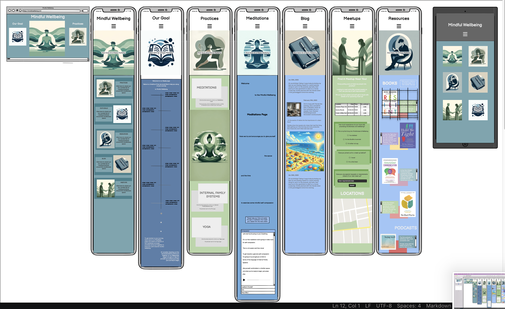

**README**
*Behind*

**Behind** will act as a resource hub for content focused around the topics of Mindfulness and Wellbeing. The website will aim to give the user a peacefully themed and designed series of webpages that are easy to navigate, within which they will find resources, a website author’s blog and a hub for indicating interest of upcoming in-person meetups.

The core audience for the website will be people who have taken on their own sort of personal journey regarding mindfulness and wellbeing. These are people who have begun to tackle their own material, either through a process with a therapist or through doing their own research into topic that are relevant to them.

For these kind of users, this website should impart a sense of calm that tick the boxes of interactivity and responsiveness, so the person using the website feels like they have been seen and that their needs have been recognised.

To this end I had move from my initial design ideas of using multiple muted colours, as pictured in my original wireframe below

*********

To a completely monochromatic look.

Using various shades of grey was the most visually appealing approach for ensuring the user’s experience was one that favoured minimalism and peacefulness.

In a sentence, the basic design philosophy of the website involves each landing page gently greeting the user with an image and a piece of landing text. The image will cover the width of the screen and will feature the small text snippet within it in a desktop view.

From the landing page of index.html, the user is encouraged to interact with the ‘Experience page’.

The purpose of the experience page is to have the user scroll down the page. The grid layout along side the position: sticky; and top: __px; attribute will ensure that small pieces of vector art of baggage are collected along the way. Eventually the user is encouraged to leave their baggage ‘Behind’ as it disappears off the top of the screen and they are presented with a number of links to take them wherever they please on the website once their interest has been piqued by this hook.

**HOME PAGE**

*****

Here the first thing the user will encounter is the nav bar. This is fixed to the top of the page so the user will at all points have a portal for hopping from page to page. The design of the drop-down menu for smartphone displays was taken and adapted from the Love Running Project, though that will be credited in much greater detail at the end of this ReadMe.

The Home Page will then welcome the user to the project, giving them an up front short summary of what they can expect when navigating Mindful Wellbeing.

It’s important here that the user isn’t overwhelmed with text and information. The snippets of text were written to be just that - short succinct text blocks offset from one another to guide the user down the landing page of the website.

Although the various pages are always available to the user via the navbar, I felt it appropriate that links also be given at the end of the home page so the user could have a coherent experience of the user experience starting on the home page and then gravitating in whichever direction they find most appealing.

**RESOURCES PAGE**

*****

This is the most content-heavy section of the website. The user is expected to visit this page the most, which is why it has second billing to the Home page and is of equal importance in the site’s hierarchy as the ‘Experience’ page.

Like the other page, there will be a landing section - a piece of text and an image welcoming the user to the page and briefly describing what can be found here.

Beneath that I’ve created a bespoke layout within which the user will find 

**MEETUPS PAGE**

****

Here the user will be offered a choice of upcoming meetups they can partake in. To signal their interest they need to fill out a number of required fields, and let us know which session they will be attending from a prepopulated datalist of upcoming available dates.

**TESTING**

The website was tested on Chrome, Firefox and Safari.

It was also passed through W3 HTML Validator and the W3 CSS Validator.

Both caught minor bugs but once addressed they passed this validation with flying colours

**Bug Fixing**

My *Experience* page wasn't working for the longest time. Eventually I'd noticed that an overflow-x value
